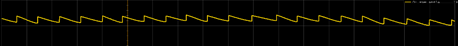
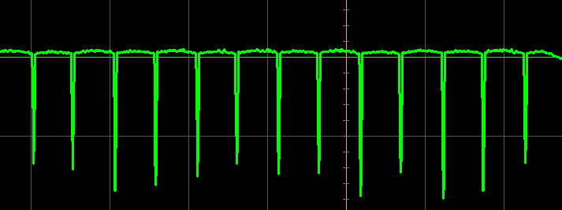
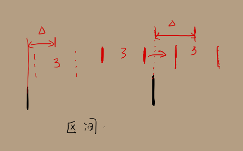

# 英雄

## 软件功能介绍
* 此代码为RM2021赛季深圳大学RobotPilots战队的英雄代码
* 此代码中仅包含英雄云台主控和底盘主控两部分代码
* 底盘主控作为中转站处理裁判系统、超电主控板和云台主控板的联系
* 云台主控负责整车逻辑控制并与底盘主控通信，以及自瞄功能的信息处理部分

### 重要功能介绍
**反陀螺算法**
直线运动模型对于单调运动的装甲板能取得较好的预测效果，但是面对小陀螺的时候容易出现自瞄预测超出车体范围导致弹丸能击打到装甲板的概率大大降低。
这个算法的核心在于通过装甲板切换时产生的跳变沿确定小陀螺装甲板的出现区间，将自瞄预测锁定在该区间内，提高自瞄预测的命中率。算法优势在于计算量小，对自瞄帧率影响可以忽略不计。
不足之处：区间更新间隔较长，对移动陀螺命中率明显降低
由于精力有限，没能继续优化该算法，因此在此抛砖引玉。

**算法原理**
首先是将相对角度加上陀螺仪的绝对坐标系获得装甲板相对云台的绝对角度。通过JSCOPE观察到当步兵在匀速小陀螺旋转时，绝对角度的变化如下：

可以将在匀速小陀螺时的装甲板浮现规律为均值随着车体角度变化的锯齿波，陀螺装甲板在区间内周期变化。
经过差分后的速度波形大致如下：

一般情况下为了避免速度跳变导致自瞄被甩飞，加入了限幅滤波将尖峰值滤除。将其滤除，说明发生了跳变，记住跳变前后的绝对角度值作为装甲板运动区间。
当预测的角度超出区间后将超出部分加到另一个区间上，当作未出现的装甲板的预测角度。

## 依赖工具

### 开发依赖工具：keil5
### 开发系统环境：windows 10
### 开发硬件环境：STM32F407

## 编译、安装方式
### 编译方式：C/C++编译
### 代码烧录：Jlink烧录

## 文件目录结构及文件用途说明

### 文件目录及其含义

* Config    	 定义了各种驱动类型以及模块设备的索引，状态枚举和系统状态结构体。
* /User/Core  	cubemx初始化文件目录以及main.c。
* /Drive  		STM32内核驱动。
* /Driver/Imu 	 陀螺仪驱动。
* /Device   	遥控器，电机，陀螺仪，小电脑等传感器的封装。
* /Module	    底盘，发射机构和云台的封装。
* /Protocol	       包含串口，陀螺仪，CAN等通信方式的具体协议和解包函数。
* /Task		    调用对应Module中的封装函数，实现Module的具体功能。
* /Algorithm       各类算法的封装，如PID, CRC, 卡尔曼滤波以及常见滤波器，自瞄预测。

## 软件与硬件的系统框图，数据流图

### 系统框图

### 数据流图

## 软件层级图

## 未来优化的方向

如何在功率限制的情况下能更好的保持自身姿态，保证四个轮子的转速比例始终符合遥控器所给的值。

目前反陀螺算法里面没有对陀螺区间进行预测，导致对移动陀螺的反击效果较差，后续考虑加入这部分功能。