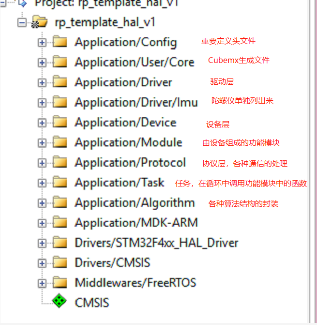
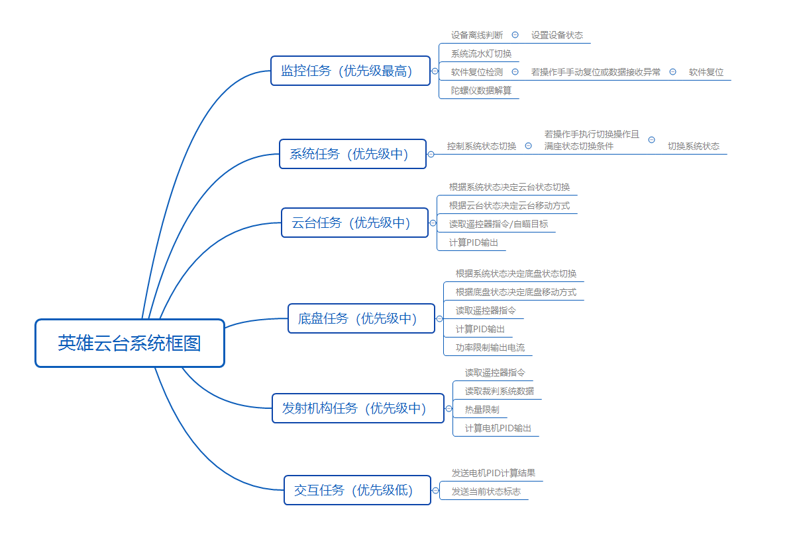
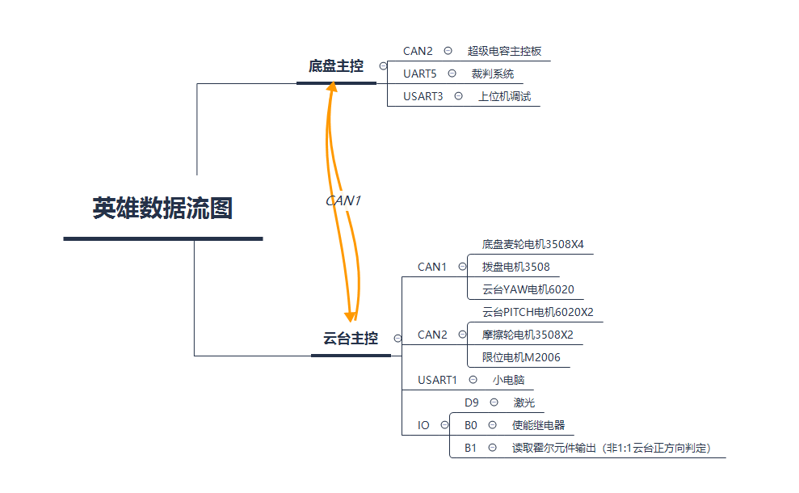

# 英雄

## 软件功能介绍
* 此代码为RM2021赛季深圳大学RobotPilots战队的英雄代码
* 此代码中仅包含英雄云台主控和底盘主控两部分代码
* 底盘主控作为中转站处理裁判系统、超电主控板和云台主控板的联系
* 云台主控负责整车逻辑控制并与底盘主控通信，以及自瞄功能的信息处理部分

## 依赖工具

### 开发依赖工具：keil5
### 开发系统环境：windows 10
### 开发硬件环境：STM32F407

## 编译、安装方式
### 编译方式：C/C++编译
### 代码烧录：Jlink烧录

## 文件目录结构及文件用途说明

### 文件目录及其含义

* Config    	 定义了各种驱动类型以及模块设备的索引，状态枚举和系统状态结构体。
* /User/Core  	cubemx初始化文件目录以及main.c。
* /Drive  		STM32内核驱动。
* /Driver/Imu 	 陀螺仪驱动。
* /Device   	遥控器，电机，陀螺仪，小电脑等传感器的封装。
* /Module	    底盘，发射机构和云台的封装。
* /Protocol	       包含串口，陀螺仪，CAN等通信方式的具体协议和解包函数。
* /Task		    调用对应Module中的封装函数，实现Module的具体功能。
* /Algorithm       各类算法的封装，如PID, CRC, 卡尔曼滤波以及常见滤波器，自瞄预测。

## 软件与硬件的系统框图，数据流图

### 系统框图

### 数据流图

## 软件层级图

## 未来优化的方向

